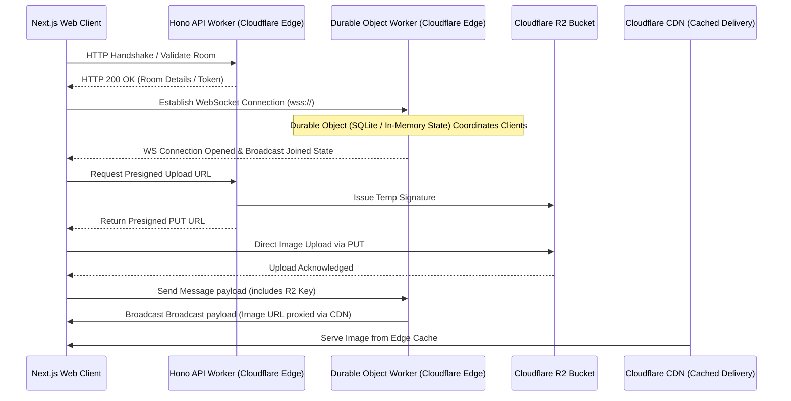

# Ephemere — Ephemeral, Edge-First Real-Time Chat

Ephemere is a high-performance, edge-first ephemeral chat platform built on a modern serverless architecture. Designed for instant collaboration, users can create temporary rooms that automatically self-destruct after a set duration, leaving zero trace on the web. 

This repository is organized as a unified monorepo powered by **Turborepo** and **pnpm Workspaces**, sharing configuration, types, and UI packages across applications.

---

## ⚡ Architecture Blueprint

Ephemere is designed around a **100% serverless, edge-computed network architecture** utilizing Cloudflare's globally distributed network for minimum latency and maximum reliability.



---

## 🛠️ Technology Stack & Architecture

### **Frontend & Interface**
*   **Next.js 16 (Turbopack & App Router):** Highly optimized build pipeline with layout routing and React Server Components.
*   **Minimalist Design & Animation:** Fluid transitions, responsive grids, and scroll-driven 3D tilt effects using **Framer Motion** and **Tailwind CSS**.
*   **State Management & Data Fetching:** 
    *   **Zustand:** Lightweight, client-side store for anonymous identity tracking and app display toggles.
    *   **TanStack Query (React Query):** Server-state caching and synchronization for dashboard histories.
    *   **Sonner:** Lightweight toast notification utility.

### **Serverless API & Gateways**
*   **Cloudflare Workers:** REST API route endpoints written in TypeScript and processed natively at the nearest Cloudflare Edge location.
*   **Hono framework:** Ultra-fast, lightweight web framework designed for edge environments.
*   **Authentication & Verification:** Token verification and guest identity tracking utilizing stateless, cryptographically signed JSON Web Tokens (JWT) handled directly at the edge.

### **Real-time Engine**
*   **Cloudflare Durable Objects:** Stateful coordination engine mapping exactly one Durable Object instance per active chat room.
    *   Maintains active client WebSocket pools directly in memory.
    *   Performs low-latency coordination of chat events, participants, and reaction updates.
    *   Uses Cloudflare's in-memory key-value systems for fast state read/writes.
*   **WebSockets:** Full-duplex client-worker communication channel using `react-use-websocket`.

### **Storage & Asset Optimization**
*   **Cloudflare R2 Storage:** S3-compatible, zero-egress-fee object store.
    *   Client requests a presigned URL from the edge worker.
    *   Client uploads image directly to R2 bucket via `PUT` request to minimize worker memory usage.
*   **Cloudflare CDN:** Delivers uploaded image thumbnails using cache control headers, fetching once from R2 and serving subsequently from edge cache location closest to the receiver.

---

## 📦 Monorepo Structure

This project uses a monorepo setup to cleanly separate frontend, backend, and shared libraries:

```yaml
ephemere/
├── apps/
│   ├── web/        # Next.js 16 Frontend Web Application
│   ├── api/        # Hono REST API deployed on Cloudflare Workers
│   └── socket/     # WebSocket Coordinator deployed on Cloudflare Workers (using Durable Objects)
├── packages/
│   ├── ui/         # Shared Design System, base Tailwind components, and icons
│   └── eslint/     # Shared ESLint configuration templates
├── package.json    # Monorepo workspaces and script orchestration
└── turbo.json      # Turborepo caching pipelines
```

---

## 🛡️ Recruiter Takeaways & Core Concepts Demonstration

Developing this project allowed me to solve several complex distributed systems and performance problems:

1.  **State Synchronization at the Edge:** Realized chat state coordination using Cloudflare Durable Objects, keeping socket pools and room memberships alive near the client without requiring a heavy centralised database for hot paths.
2.  **Zero-Egress Asset Pipeline:** Configured image uploads using presigned PUT links direct to Cloudflare R2, bypassing API servers entirely during payload delivery to prevent network bottlenecks and minimize execution costs.
3.  **Turborepo Task Caching:** Set up efficient CI/CD caching pipelines using Turborepo so linting, type-checking, formatting, and building are only executed for packages containing changes.
4.  **Edge Hydration Flash Resolution:** Authored a dedicated theme injection script running in the `<head>` of the root Next.js layout to read settings from `localStorage` and toggle DOM classnames before the first browser paint. This completely eliminates light/dark layout flashes (FOUC).
5.  **Infinite Re-Render Elimination:** Optimized React state dependency matrices across React Query hooks, WebSocket subscriptions, and setInterval counters to prevent infinite render cycles and connection thrashing.

---

## 🚀 Getting Started

### **Prerequisites**
*   **Node.js 20+**
*   **pnpm 9+**
*   **Wrangler CLI** (for Cloudflare Workers local emulation)

### **Installation**
1.  Clone the repository:
    ```bash
    git clone https://github.com/ArDnath/Ephemere.git
    cd Ephemere
    ```
2.  Install dependencies:
    ```bash
    pnpm install
    ```
3.  Configure your environment variables inside `apps/web/.env` and `apps/socket/.env` (refer to `.env.example` templates in each app folder).

### **Local Development**
Start the entire stack (Next.js web client, API worker, and WebSocket worker) concurrently using Turborepo:
```bash
pnpm dev
```
The workspace will build your dependencies, start hot reloading, and bind the services:
*   Frontend: `http://localhost:3000`
*   REST API: `http://localhost:4001`
*   Socket Gateway: `http://localhost:8080`
