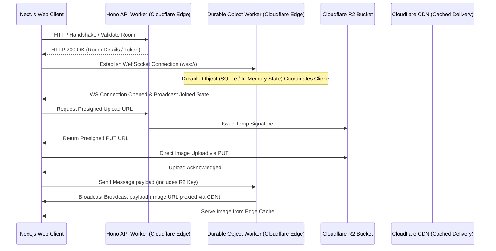

# Ephemere — Ephemeral, Edge-First Real-Time Chat

Ephemere is a high-performance, edge-first ephemeral chat platform built on a modern serverless architecture. Designed for instant collaboration, users can create temporary rooms that automatically self-destruct after a set duration, leaving zero trace on the web. 


This repository is organized as a unified monorepo powered by **Turborepo** and **pnpm Workspaces**, sharing configuration, types, and UI packages across applications.

---

## ⚡ Architecture Blueprint

Ephemere is designed around a **100% serverless, edge-computed network architecture** utilizing Cloudflare's globally distributed network for minimum latency and maximum reliability.



---

## 🛠️ Technology Stack & Architecture

### **Frontend & Interface**
*   **Next.js 16 (Turbopack & App Router):** Highly optimized build pipeline with layout routing and React Server Components.
*   **Minimalist Design & Animation:** Fluid transitions, responsive grids, and scroll-driven 3D tilt effects using **Framer Motion** and **Tailwind CSS**.
*   **State Management & Data Fetching:** 
    *   **Zustand:** Lightweight, client-side store for anonymous identity tracking and app display toggles.
    *   **TanStack Query (React Query):** Server-state caching and synchronization for dashboard histories.
    *   **Sonner:** Lightweight toast notification utility.

### **Serverless API & Gateways**
*   **Cloudflare Workers:** REST API route endpoints written in TypeScript and processed natively at the nearest Cloudflare Edge location.
*   **Hono framework:** Ultra-fast, lightweight web framework designed for edge environments.
*   **Authentication & Verification:** Token verification and guest identity tracking utilizing stateless, cryptographically signed JSON Web Tokens (JWT) handled directly at the edge.

### **Real-time Engine**
*   **Cloudflare Durable Objects:** Stateful coordination engine mapping exactly one Durable Object instance per active chat room.
    *   Maintains active client WebSocket pools directly in memory.
    *   Performs low-latency coordination of chat events, participants, and reaction updates.
    *   Uses Cloudflare's in-memory key-value systems for fast state read/writes.
*   **WebSockets:** Full-duplex client-worker communication channel using `react-use-websocket`.

### **Storage & Asset Optimization**
*   **Cloudflare R2 Storage:** S3-compatible, zero-egress-fee object store.
    *   Client requests a presigned URL from the edge worker.
    *   Client uploads image directly to R2 bucket via `PUT` request to minimize worker memory usage.
*   **Cloudflare CDN:** Delivers uploaded image thumbnails using cache control headers, fetching once from R2 and serving subsequently from edge cache location closest to the receiver.

---

## 📦 Monorepo Structure & Workspaces

This repository uses a structured monorepo design managed via **pnpm Workspaces** and **Turborepo** to isolate execution logic while maximizing module reusability across platforms:

```yaml
ephemere/
├── apps/
│   ├── web/                     # Next.js 16 Frontend Web Client (Turbopack, Zustand, React Query)
│   │   ├── app/                 # App Router (root dashboard, auth, rooms, layout definitions)
│   │   ├── components/          # Minimalist interface systems (ChatRoom, Home, UI widgets)
│   │   ├── hooks/               # Custom hooks (session, lifecycle, scroll, and countdown handlers)
│   │   └── lib/store/           # Client-side stores (IdentityStore, RoomStore)
│   │
│   ├── api/                     # Cloudflare Workers API Gateway (built with Hono)
│   │   ├── src/controllers/     # Handles guest auth handshakes, upload signature requests, and rooms
│   │   └── wrangler.jsonc       # API Worker deployment configuration
│   │
│   └── socket/                  # Real-Time WebSocket Server (Cloudflare Workers + Durable Objects)
│       ├── src/                 # Durable Object class handling message broadcasts & client pools
│       └── wrangler.jsonc       # WebSocket DO deployment configuration
│
├── packages/
│   ├── db/                      # Shared Database Layer (Drizzle ORM & Postgres Schema migrations)
│   │   ├── src/schema.ts        # Common database schemas shared across web client and API workers
│   │   └── drizzle.config.ts    # Database synchronization configurations
│   │
│   ├── lib/                     # Common utilities, schema types, and helper classes
│   │
│   ├── ui/                      # Unified design system, Tailwind components, and core SVG assets
│   │
│   ├── tailwind-config/         # Shared base Tailwind styles, animations, and typography rules
│   │
│   ├── typescript-config/       # Base configurations for TypeScript compiler settings
│   │
│   └── eslint-config/           # Custom linting configurations extending basic specifications
│
├── package.json                 # Monorepo task script orchestrations (dev, build, lint, typecheck)
└── turbo.json                   # Cache inputs/outputs configuration for build optimization
```

---

## 🛡️ Key Engineering Decisions & Implementations

To ensure high performance, stability, and zero-egress asset overhead at scale, the following system design decisions were made:

1.  **State Synchronization at the Edge:** Chat room synchronization is managed via Cloudflare Durable Objects. This isolates websocket management and room states (including user metadata) to single-tenant edge instances, keeping database hits minimal during chat sessions.
2.  **Zero-Egress Asset Pipeline:** Image uploads bypass the API worker's memory limits entirely. The client requests a presigned PUT URL from the Hono API, uploading assets directly to Cloudflare R2, which are then served using edge-caching via Cloudflare CDN.
3.  **Turborepo Build Pipeline:** CI/CD tasks are optimized using Turborepo. Building, linting, formatting, and type-checking checks are isolated per workspace, relying on remote caching outputs to save CPU cycles and speed up deployment runs.
4.  **Zero FOUC (Flash of Unstyled Content):** Pre-hydrated theme selection is resolved via a lightweight, blocking script execution in Next.js's `<head>`. Theme parameters are verified from local storage or media preferences prior to the primary render cycle to eliminate screen flashes.
5.  **Re-Render Optimization:** Solved infinite WebSocket reconnection cycles and timer hook drift by shifting volatile dependencies (like Date references and runtime socket properties) into memoized bindings and Refs, preventing redundant component mounts.

---

## 🚀 Getting Started

### **Prerequisites**
*   **Node.js 20+**
*   **pnpm 9+**
*   **Wrangler CLI** (for Cloudflare Workers local emulation)

### **Installation**
1.  Clone the repository:
    ```bash
    git clone https://github.com/ArDnath/Ephemere.git
    cd Ephemere
    ```
2.  Install dependencies:
    ```bash
    pnpm install
    ```
3.  Configure your environment variables inside `apps/web/.env` and `apps/socket/.env` (refer to `.env.example` templates in each app folder).

### **Local Development**
Start the entire stack (Next.js web client, API worker, and WebSocket worker) concurrently using Turborepo:
```bash
pnpm dev
```
The workspace will build your dependencies, start hot reloading, and bind the services:
*   Frontend: `http://localhost:3000`
*   REST API: `http://localhost:4001`
*   Socket Gateway: `http://localhost:8080`
